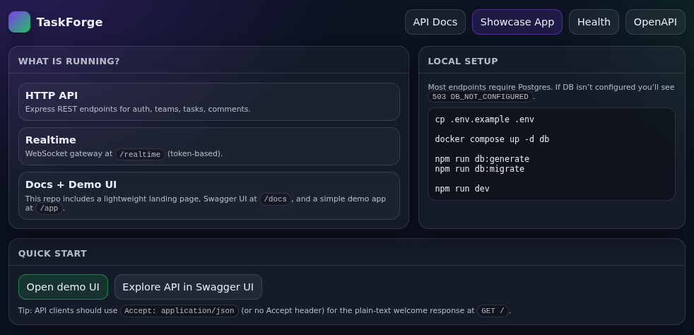
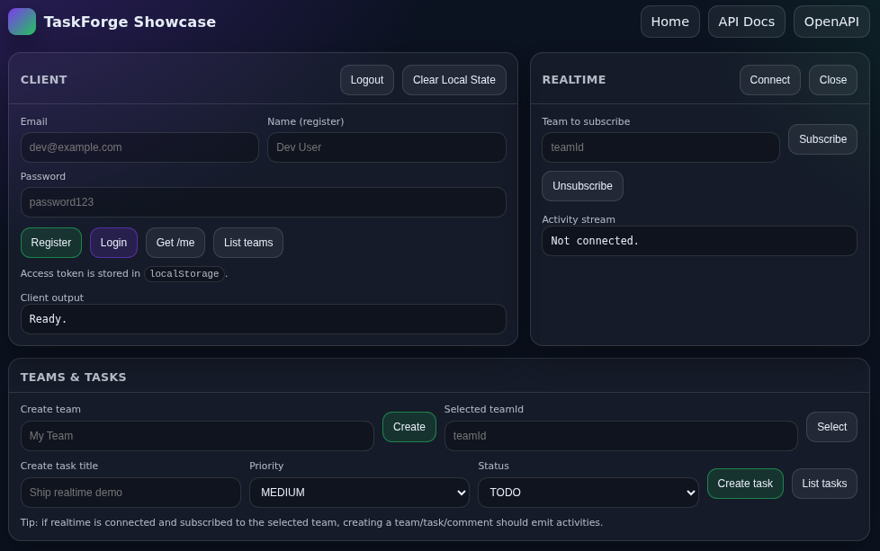

# TaskForge

TaskForge is a real-time team task tracker for managing tasks, deadlines, and collaboration with live updates.

## Project goals

- **Realtime collaboration:** Live task updates, notifications, and presence.
- **Production practices:** Clear layering, strong security defaults, predictable error handling, and observable services.
- **Open-source ready:** Clean contributor experience, documented architecture, and incremental delivery.

## Architecture (high level)

- **API:** HTTP REST endpoints for authentication, teams, tasks, comments, and activity logs.
- **Realtime gateway:** WebSocket transport for low-latency task updates, notifications, and presence.
- **Database:** PostgreSQL as the system of record (normalized schema + indexing strategy).
- **Cache / pubsub (scaling):** Redis as an optional component for rate limiting, presence, and WebSocket fanout in multi-instance deployments.

See:

- [docs/architecture.md](docs/architecture.md#architecture)
- [docs/data-model.md](docs/data-model.md#data-model)
- [docs/realtime.md](docs/realtime.md#realtime-design)
- [docs/stack.md](docs/stack.md#technology-stack)

## Development status

TaskForge is an Express-based HTTP API with a WebSocket realtime gateway. This repository also includes a lightweight landing page, Swagger UI, and a small demo UI to exercise the API.

## Showcase (local)

Local URLs:

- **Landing:** `http://localhost:3000/`
- **Demo UI:** `http://localhost:3000/app`
- **Swagger UI:** `http://localhost:3000/docs`
- **OpenAPI spec:** `http://localhost:3000/openapi.json`
- **Health:** `http://localhost:3000/health`

Notes:

- Browsers hitting `/` will receive HTML. API clients (e.g. `curl`) will receive plain text.
- Static assets are served from `http://localhost:3000/static/*`.

## Screenshots

### Landing (/)

<p align="center">
  
</p>

### Demo UI (/app)

<p align="center">
  
</p>

## Local development

```bash
npm install
cp .env.example .env

docker compose up -d db

npm run db:generate
npm run db:migrate

npm run dev
```

Note: most endpoints require Postgres. If DB is not configured you will see `503 DB_NOT_CONFIGURED`.

Realtime:

- WebSocket endpoint: `ws://localhost:3000/realtime?token=<accessToken>`

Run tests:

```bash
npm test
```
